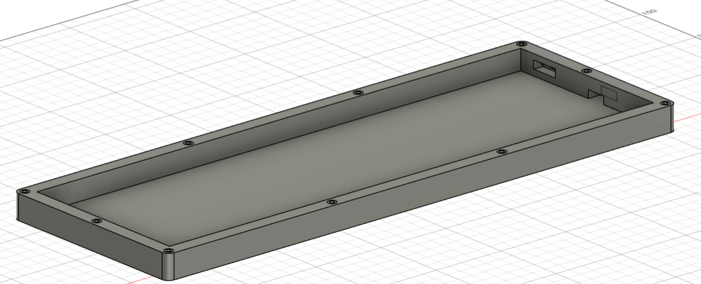
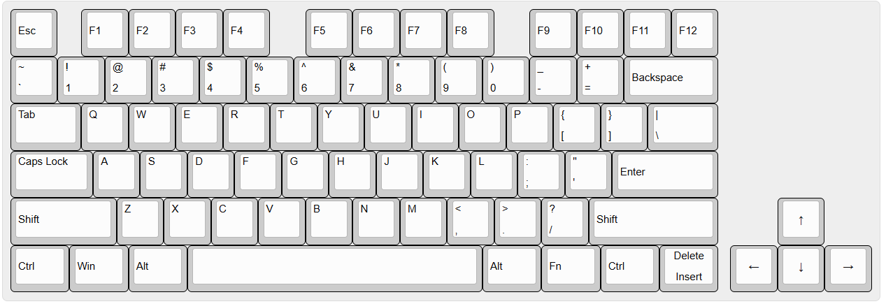
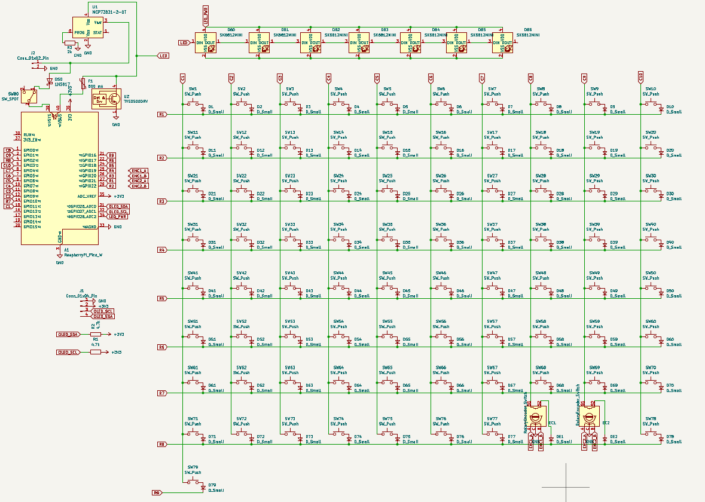

# Custom Wireless Mechanical Keyboard (Pico W)

A custom-designed **wireless mechanical keyboard** built around the **Raspberry Pi Pico W**, featuring a hand-wired key matrix, rotary encoders, RGB underglow, OLED display, rechargeable battery support, and a fully custom 3D-printed case.

---

## 📸 Project Overview

### Top Plate

### Case (Bottom Shell)

### Key Layout

### Electrical Schematic

---

## 🧩 Bill of Materials (Summary)

### Core Electronics
- Raspberry Pi Pico W ×1  
- Mechanical key switches ×78  
- Keyboard diodes ×81  
- SK6812 MINI RGB LEDs ×7  
- Rotary encoders ×2  
- 0.91″ OLED display ×1  
- MCP73831 Li-ion charger ×1  
- TVS ESD protection IC ×1  
- Fuse (500 mA) ×1  
- Resistors (4.7 kΩ ×2, 2 kΩ ×1)  

### Power & Connectivity
- Protected Li-Po battery ×1  
- JST 2-pin battery connector ×1  
- USB connector / header ×1  
- SS12F15 slide switch ×1  

### Mechanical & Assembly
- MX keycaps ×78 (look layout for reference)  
- Rotary encoder caps ×2  
- Copper wire (for hand wiring)  
- Solder board / perfboard  
- M3 × 20 mm screws ×8  
- M3 heat-set inserts ×8  

---

## 🛠 Assembly Notes

- The keyboard matrix is primarily **hand-wired**
- Diodes should be oriented consistently per row
- RGB LEDs are chained in series (DIN → DOUT)
- Heat-set inserts are recommended for durability
  - Battery
  - OLED
  - Encoder bodies
  - USB port access

---

## 📂 Repository Structure

